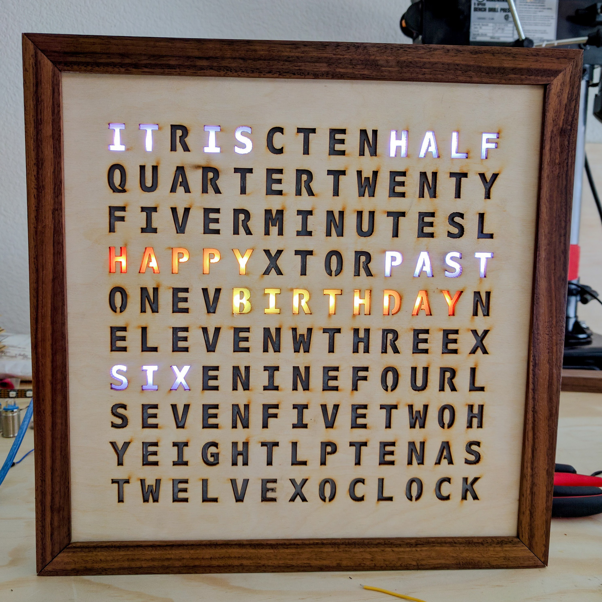

# Wordclock
:construction: **Under Construction** :construction:

Instructions how to make this:

# Contents
* [Materials](#materials)
    * [Frame Construction](#frame-construction)
        * [Parts](#parts)
        * [Laser Cutter](#laser-cutter)
    * [Electronics](#electronics)
* [Software](#software)
    * [PlatformIO](#platformio)
* [TODO](#todo)

# Materials
## Frame Construction
### Parts
* 12" x 12" 1/8" plywood (x3) for the face, back, and grid.
* 12" x 12" acrylic (need to figure out how opaque). Make sure you get acrylic and not the toxic stuff. These pieces will sit in the grid which 1) prevents light from leaking out and 2) diffuses the light across the entire letter.
* Get dimensions for walnut

The frame of the clock consists of the following parts:
* Laser cut face
* Laser cut grid which should be glued to the back of the face. You can edit the `face.svg` file and just remove all of the letters.
* Laser cut acylic pieces that fit into the grid. Should be glued carefully to the back of the letters
* Laser cut back
* Walnut sides

### Laser Cutter
Files for the laser cut parts are in the `lasercut` folder. You'll probably need to convert the svgs to dxfs first. I'm familiar with Ikscape so I'll go through those steps:
- open an svg in Inkscape
- Select everything. There should be an outer box border
- Change the stroke color to blue and path to 0.01mm
- With everything selected, change the dimensions to 11"x11" for the face file. The grid should be 8.7"x8.7". You can double check these measurements by superimposing the grid over the face and make sure the grid cutouts align with the letters
- Save as `.dxf`. There's some option for 12/14. Use 14.

## Electronics
Parts list:
* LED strip, 60/m. Note: the arduino code assumes that an APA102 strip is being used. That can easily be changed.
* ESP-32. Any board with 2 free GPIO pins should work.
* 9-12V, 1.5A power supply (see notes below)
* Push buttons
* Buck converter

# Software
## PlatformIO
[PlatformIO](https://platformio.org/) is used to build this project. It provides much better tooling than the standard Arduino IDE. Google instructions for how to setup PlatformIO for VSCode then open this project.

The software is _sort of_ structured in a way to make swapping out LED strips or layouts. I haven't quite figured out how to do this configuration with C++. Perform the following steps if you would like to use a different layout (e.g. a different language) or a different display (e.g. WS28):
* create a concrete implementation of the respective base class (check the `lib` folder)
* poke around in `src/main.cpp` and swap them in

# TODO
* power consumption notes
* software + wiring notes
* links to products
